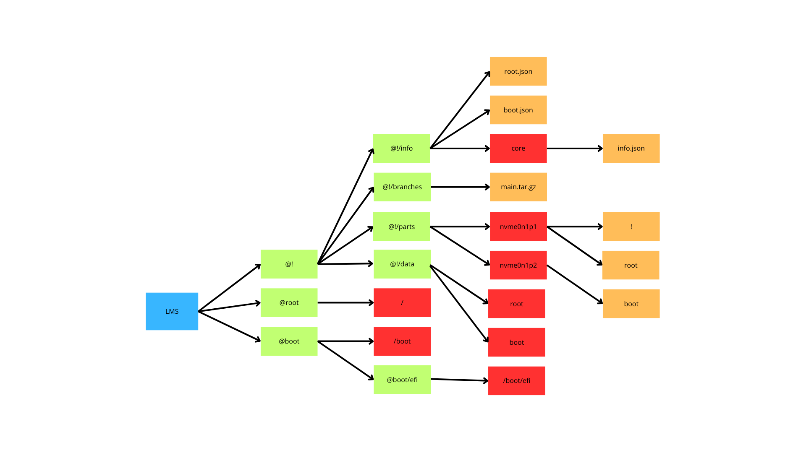

# Logical Media System



**LMS** (Logical Media System) is a flexible disk structure layout and partitioning format designed to organize system components in a logical, extensible way. LMS introduces two types of partition formats:

## 📦 Partition Types

### 🟩 `lms_partmaster` (Master Partition)

This is always the **first partition** on any disk using LMS.

- It stores the **Logical Media Volume Files**
- Contains the special `!` directory, which manages LMS

#### Example:
```
nvme0n1p1 (lms_partmaster)
├── !
└── root
```
- `!`: LMS master
- `root`: A logical media volume (e.g., the system root)

---

### 🟥 `lms_part` (Standard LMS Partition)

Used for additional volumes across separate partitions.

#### Example:
```
nvme0n1p2 (lms_part) 
└── boot
```
- `boot`: Logical volume for boot files or kernels

---

## 📁 Directory Structure Overview

Here's a brief outline of how LMS organizes volumes and metadata:
```
LMS 
├── @! # LMS Master directory (inside lms_partmaster) 
│   ├── @!/info # Core info (root.json, boot.json) 
│   ├── @!/branches # Logical volume tree (main.tar.gz) 
│   ├── @!/parts # Device-partition mapping (e.g. nvme0n1p1) 
│   └── @!/data # Mount reference for volumes 
├── @root # Reference to system root volume 
└── @boot # Reference to boot volume 
    └── @boot/efi # Reference to EFI volume
```
---

## 💾 How LMS Works

- LMS detects `lms_partmaster` as the master index for all volumes on a disk.
- It reads metadata from `@!/info` and `@!/branches` to map and mount volumes.
- All other LMS partitions (`lms_part`) are linked via `@!/parts`.

---

## 🚧 Status

This project is in early development and the structure is subject to change.  
Stay tuned for formatting tools, bootloader integration, and more.

---

## 📜 License

[NPL 1.0](LICENSE.md)

